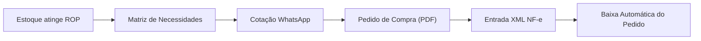

# PRIMOX Workshop 2.0 — Manual do Usuário
## 03. Gestão de Compras e Produtos em Falta (Anti-Ruptura)

---

### 1. Visão Geral do Módulo

O módulo de **Gestão de Compras e Anti-Ruptura** foi arquitetado com base em conceitos consagrados de suprimentos automotivos para garantir que a oficina nunca recuse serviço por falta de peças críticas (baterias, relés, fusíveis, lâmpadas, reguladores de voltagem, rolamentos e cabos).

Ao mesmo tempo, evita o excesso de capital de giro parado em peças de baixo giro através do cálculo automatizado de **Ponto de Ressuprimento (ROP)** e da **Curva de Consumo ABC**.

---

### 2. Acesso à Tela de Necessidades de Compra

1. No menu lateral do ERP, clique em **Compras / Falta**.
2. A tela exibe quatro métricas essenciais no topo:
   - **Itens Abaixo do Mínimo:** Peças cujo estoque atual é inferior ao estoque de segurança.
   - **Itens no Ponto de Pedido (ROP):** Peças que atingiram a marca matemática onde o pedido precisa ser disparado hoje.
   - **Sugestões de Compra:** Quantidade calculada para restabelecer o estoque ideal.
   - **Valor Estimado de Compras (R$):** Montante financeiro previsto com base no último custo histórico.

---

### 3. A Matemática do Ponto de Ressuprimento (ROP)

O PRIMOX utiliza a fórmula padrão de logística industrial para calcular o momento exato de comprar:

$$\text{ROP} = (\text{CMD} \times \text{Lead Time}) + \text{Estoque de Segurança}$$

Onde:
- **CMD (Consumo Médio Diário):** Calculado automaticamente analisando todas as saídas de peças em Ordens de Serviço e Vendas diretas dos últimos 60 dias ($\div 60$).
- **Lead Time (Dias de Entrega):** Quantos dias o distribuidor leva entre o recebimento do pedido e a entrega física na oficina (ex: 2 dias para distribuidores locais, 5 dias para entregas de fábrica).
- **Estoque de Segurança:** Quantidade mínima mantida na prateleira para cobrir oscilações imprevistas na demanda do cliente.

---

### 4. Ciclo Operacional de Compras Passo a Passo

#### Passo 1: Filtragem e Seleção de Itens
1. Na grade de produtos, visualize os itens marcados com status:
   - **Crítico (Vermelho):** Estoque Zerado ou abaixo do Estoque de Segurança.
   - **Atenção (Âmbar):** Estoque entre a Segurança e o Ponto de Pedido (comprar agora).
   - **Regular (Verde):** Estoque saudável.
2. Marque a caixa de seleção dos itens que deseja encomendar. O PRIMOX preenche automaticamente a **Quantidade Sugerida** ideal.

#### Passo 2: Cotação Instantânea via WhatsApp
1. Selecione o fornecedor cadastrado para os produtos escolhidos.
2. Clique no botão **Cotar via WhatsApp**.
3. O sistema formata uma mensagem comercial profissional pronta para envio com código, descrição e quantidade:
   > *"Olá! Gostaria de cotar os seguintes itens para a Primo Auto Elétrica:\n- 10x Bateria Moura 60Ah (M60GD)\n- 50x Lâmpada H4 12V 60/55W Philips\n- 20x Relé Auxiliar 4 Pinos 40A DNI\nFavor informar preço unitário e previsão de entrega."*
4. O link direciona para o WhatsApp Web ou Desktop com a mensagem preenchida.

#### Passo 3: Geração do Pedido de Compra Oficial em PDF
1. Após acordar o preço com o distribuidor, clique em **Gerar Pedido de Compra**.
2. O PRIMOX abre a janela de confirmação de pedido:
   - Número único gerado sequencialmente (ex: *PED-2026-0015*).
   - Fornecedor vinculado, data de entrega acordada e condições de pagamento.
3. Clique em **Emitir Pedido PDF**.
4. O sistema gera um documento timbrado com logotipo da oficina, dados cadastrais, CNPJ, itens e valores acordados para ser enviado por e-mail ou WhatsApp ao departamento faturamento da distribuidora.

---

### 5. Recebimento e Baixa Automática de Pedidos com XML de NF-e

Quando o distribuidor entrega a mercadoria acompanhada da Nota Fiscal Eletrônica:
1. Acesse o menu **Importar NF-e**.
2. Carregue o arquivo XML da nota fiscal emitida pelo fornecedor.
3. O sistema PRIMOX:
   - Identifica o CNPJ do emitente.
   - Faz o batimento automático com o **Pedido de Compra** que estava com status *Pendente*.
   - Compara as quantidades e valores faturados com o pedido original.
   - Alimenta o estoque físico e cadastra as contas a pagar no módulo financeiro.
   - Atualiza o status do pedido de compra para **Recebido Integralmente**.
