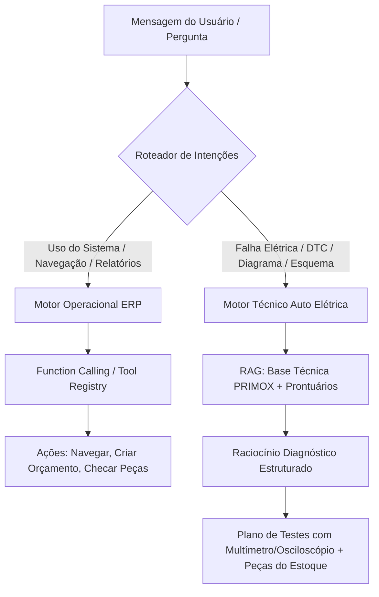
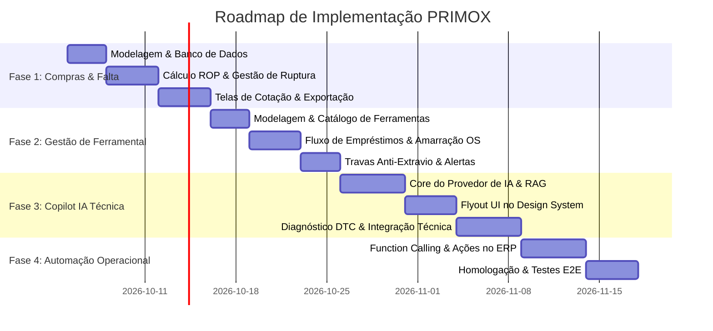

# PRIMOX Workshop — Especificação e Roadmap Técnico
## Módulos: Controle de Ferramental, Gestão de Compras/Anti-Ruptura e Copilot de IA Especialista

> **Data de Criação:** 2026-10-03  
> **Status:** Proposta Aprovada / Backlog de Implementação  
> **Aplica-se a:** PRIMOX Workshop (WPF · .NET 6-windows · C# 10)  
> **Arquitetura Base:** SQLite / SQL Server · PRIMOX Design System (Dark/Light) · MVVM / Service Layer  

---

## 1. Visão Geral e Objetivos de Negócio

Este documento detalha o planejamento arquitetural, os modelos de dados, as regras de negócio, a interface de usuário e o plano de entrega passo a passo de três expansões estratégicas para o **PRIMOX Workshop**:

1. **Gestão e Controle de Ferramental Especializado**: Rastreabilidade de instrumentos caros (scanners, osciloscópios, alicates amperímetros, programadores), controle de empréstimos a técnicos e amarração às Ordens de Serviço (evitando esquecimento de ferramentas nos carros de clientes).
2. **Monitor de Ruptura, Estoque Mínimo e Gestão de Compras**: Automação do ponto de pedido ($ROP$) para insumos críticos de auto elétrica (relés, fusíveis, lâmpadas, terminais, reguladores), geração de cotações automáticas e baixa direta via importação de NF-e.
3. **Copilot de IA Dual-Engine (Operacional + Especialista Elétrico)**: Assistente inteligente embarcado no ERP capaz de operar o sistema via *Function Calling* e diagnosticar falhas automotivas complexas (código DTC, quedas de tensão, fuga de corrente) conectado à base de conhecimento do PRIMOX.

---

## 2. PILAR 1: Módulo de Controle e Gestão de Ferramental

### 2.1. Problemas Resolvidos
- Extravio ou esquecimento de ferramentas caras dentro dos veículos de clientes após a montagem.
- Desperdício de tempo de bancada procurando com qual eletricista/mecânico está determinado equipamento.
- Uso de instrumentos descalibrados ou danificados que geram falsos diagnósticos.

### 2.2. Modelo de Dados (Entidades)

```csharp
namespace PrimoAutoEletrica.Models
{
    public enum StatusFerramenta
    {
        Disponivel = 1,
        EmUso = 2,
        EmManutencao = 3,
        Avariada = 4,
        Extraviada = 5
    }

    public enum CategoriaFerramenta
    {
        DiagnosticoEletronico = 1, // Scanners, programadores, osciloscópios
        MedicaoEletrica = 2,       // Multímetros, alicates amperímetros, canetas de polaridade
        BateriasECarga = 3,        // Testadores de condutância, carregadores inteligentes
        EletricaEMontagem = 4,     // Alicates de crimpar especiais, desencapadores, soldadores
        MecanicaGeral = 5          // Soquetes, torquímetros, chaves especiais
    }

    public sealed class Ferramenta
    {
        public Guid Id { get; set; } = Guid.NewGuid();
        public string CodigoPatrimonio { get; set; } = string.Empty; // Ex: FER-0012
        public string Nome { get; set; } = string.Empty;             // Ex: Osciloscópio Automotivo 4CH
        public CategoriaFerramenta Categoria { get; set; }
        public string MarcaModelo { get; set; } = string.Empty;      // Ex: Hantek 1008C
        public string NumeroSerie { get; set; } = string.Empty;
        public string LocalizacaoArmario { get; set; } = string.Empty;// Ex: Armário 01 / Gaveta C
        public StatusFerramenta Status { get; set; } = StatusFerramenta.Disponivel;
        public decimal ValorAquisicao { get; set; }
        public DateTime DataAquisicao { get; set; } = DateTime.Now;
        public bool RequerCalibracaoPeriodica { get; set; }
        public int IntervaloCalibracaoDias { get; set; }
        public DateTime? UltimaCalibracao { get; set; }
        public DateTime? ProximaCalibracao { get; set; }
        public Guid? FuncionarioPosseAtualId { get; set; }
        public string? FuncionarioPosseAtualNome { get; set; }
        public Guid? OrdemServicoAtualId { get; set; }
        public string? NumeroOSAtual { get; set; }
        public string? Observacoes { get; set; }
        public bool Ativo { get; set; } = true;
    }

    public sealed class MovimentacaoFerramenta
    {
        public Guid Id { get; set; } = Guid.NewGuid();
        public Guid FerramentaId { get; set; }
        public Guid FuncionarioId { get; set; }
        public Guid? OrdemServicoId { get; set; }
        public DateTime DataRetirada { get; set; } = DateTime.Now;
        public DateTime PrevisaoDevolucao { get; set; }
        public DateTime? DataDevolucao { get; set; }
        public string EstadoConservacaoRetirada { get; set; } = "OK";
        public string? EstadoConservacaoDevolucao { get; set; }
        public string? ObservacaoDevolucao { get; set; }
        public string RegistradoPor { get; set; } = "Sistema";
    }
}
```

### 2.3. Esquema de Banco de Dados (SQLite / SQL Server)

```sql
CREATE TABLE IF NOT EXISTS Ferramentas (
    Id TEXT PRIMARY KEY,
    CodigoPatrimonio TEXT NOT NULL UNIQUE,
    Nome TEXT NOT NULL,
    Categoria INTEGER NOT NULL,
    MarcaModelo TEXT,
    NumeroSerie TEXT,
    LocalizacaoArmario TEXT,
    Status INTEGER NOT NULL DEFAULT 1,
    ValorAquisicao REAL DEFAULT 0,
    DataAquisicao TEXT,
    RequerCalibracaoPeriodica INTEGER DEFAULT 0,
    IntervaloCalibracaoDias INTEGER DEFAULT 0,
    UltimaCalibracao TEXT,
    ProximaCalibracao TEXT,
    FuncionarioPosseAtualId TEXT,
    OrdemServicoAtualId TEXT,
    Observacoes TEXT,
    Ativo INTEGER DEFAULT 1
);

CREATE TABLE IF NOT EXISTS MovimentacoesFerramentas (
    Id TEXT PRIMARY KEY,
    FerramentaId TEXT NOT NULL,
    FuncionarioId TEXT NOT NULL,
    OrdemServicoId TEXT,
    DataRetirada TEXT NOT NULL,
    PrevisaoDevolucao TEXT NOT NULL,
    DataDevolucao TEXT,
    EstadoConservacaoRetirada TEXT,
    EstadoConservacaoDevolucao TEXT,
    ObservacaoDevolucao TEXT,
    RegistradoPor TEXT,
    FOREIGN KEY(FerramentaId) REFERENCES Ferramentas(Id),
    FOREIGN KEY(FuncionarioId) REFERENCES Funcionarios(Id),
    FOREIGN KEY(OrdemServicoId) REFERENCES OrdensServico(Id)
);

CREATE INDEX IF NOT EXISTS IX_Ferramentas_Status ON Ferramentas(Status);
CREATE INDEX IF NOT EXISTS IX_Movimentacoes_Devolucao ON MovimentacoesFerramentas(DataDevolucao);
```

### 2.4. Regras de Negócio e Travas de Segurança
1. **Trava Anti-Extravio na Finalização de OS**:
   - Ao clicar em "Concluir OS" ou "Entregar Veículo", o sistema consulta se `OrdemServicoAtualId == os.Id`.
   - Se houver ferramentas retidas, exibe modal crítico:
     > *"Atenção: A ferramenta [FER-0004 - Scanner Raven 3] ainda consta vinculada a esta OS. Confirme o recolhimento e a devolução no armário antes da saída do veículo."*
2. **Alerta de Fim de Expediente**:
   - Job em segundo plano acionado 30 min antes do fechamento: dispara notificação via `ShellNotificationService` listando todos os itens em posse de técnicos que devem ser guardados.
3. **Integração com `AutoEletricaTecnicaControl`**:
   - Cada roteiro diagnóstico (ex: *D01 - Veículo não dá partida*) possui lista de ferramentas requeridas (`Multimetro`, `Alicate Amperimetro`, `Scanner`).
   - A tela exibirá tags dinâmicas: verde se disponível, amarelo se em uso em outra bancada com indicação do técnico responsável.

### 2.5. Como deve ficar no final
- Novo módulo na Sidebar: **Ferramentaria**.
- Visão visual de armários/gavetas com cards coloridos pelo status da ferramenta.
- Leitura rápida via código de barras/QR Code da etiqueta da ferramenta para retirada em menos de 5 segundos.

---

## 3. PILAR 2: Módulo de Produtos em Falta & Gestão de Compras (Anti-Ruptura)

### 3.1. Problemas Resolvidos
- Faltar relé de R$ 15 que bloqueia a entrega de uma OS de R$ 800.
- Falta de controle sobre quais peças foram pedidas ao distribuidor e ainda não chegaram.
- Demora na montagem manual de listas de compra para envio ao fornecedor por WhatsApp ou e-mail.

### 3.2. Modelo de Dados (Entidades)

```csharp
namespace PrimoAutoEletrica.Models
{
    public enum NivelUrgenciaFalta
    {
        Critica = 1, // Estoque Zerado + OS ativa aguardando
        Alta = 2,    // Abaixo do Estoque Mínimo
        Media = 3,   // Ponto de Pedido atingido
        Preventiva = 4 // Reposição Curva ABC
    }

    public enum StatusPedidoCompra
    {
        Rascunho = 1,
        CotacaoEnviada = 2,
        AprovadoAguardandoEntrega = 3,
        RecebidoParcial = 4,
        RecebidoTotal = 5,
        Cancelado = 6
    }

    public sealed class ItemFaltaEstoque
    {
        public Guid ProdutoId { get; set; }
        public string Codigo { get; set; } = string.Empty;
        public string Nome { get; set; } = string.Empty;
        public string Categoria { get; set; } = string.Empty;
        public int QuantidadeEstoque { get; set; }
        public int QuantidadeMinima { get; set; }
        public int QuantidadeReservadaOS { get; set; }
        public int SaldoRealDisponivel => QuantidadeEstoque - QuantidadeReservadaOS;
        public int QuantidadeSugeridaCompra { get; set; }
        public decimal UltimoCustoCompra { get; set; }
        public decimal ValorTotalEstimado => QuantidadeSugeridaCompra * UltimoCustoCompra;
        public NivelUrgenciaFalta Urgencia { get; set; }
        public string CurvaAbc { get; set; } = "B";
        public Guid? FornecedorPreferencialId { get; set; }
        public string? FornecedorPreferencialNome { get; set; }
    }

    public sealed class PedidoCompra
    {
        public Guid Id { get; set; } = Guid.NewGuid();
        public string Numero { get; set; } = string.Empty; // Ex: PC-2026-0089
        public Guid FornecedorId { get; set; }
        public string FornecedorNome { get; set; } = string.Empty;
        public string FornecedorTelefone { get; set; } = string.Empty;
        public StatusPedidoCompra Status { get; set; } = StatusPedidoCompra.Rascunho;
        public decimal ValorTotal { get; set; }
        public DateTime DataCriacao { get; set; } = DateTime.Now;
        public DateTime? PrevisaoEntrega { get; set; }
        public DateTime? DataRecebimento { get; set; }
        public string? ChaveNFeVinculada { get; set; }
        public string? Observacoes { get; set; }
        public List<PedidoCompraItem> Itens { get; set; } = new();
    }

    public sealed class PedidoCompraItem
    {
        public Guid Id { get; set; } = Guid.NewGuid();
        public Guid PedidoCompraId { get; set; }
        public Guid ProdutoId { get; set; }
        public string Codigo { get; set; } = string.Empty;
        public string Descricao { get; set; } = string.Empty;
        public int QuantidadePedida { get; set; }
        public int QuantidadeRecebida { get; set; }
        public decimal ValorUnitarioAcordado { get; set; }
        public decimal Subtotal => QuantidadePedida * ValorUnitarioAcordado;
    }
}
```

### 3.3. Algoritmo de Cálculo Automático do Ponto de Pedido

O cálculo automático de necessidade de compras utiliza o histórico de saídas das Ordens de Serviço e Vendas:

$$\text{Ponto de Pedido (ROP)} = (\text{Consumo Médio Diário} \times \text{Lead Time do Fornecedor em Dias}) + \text{Estoque de Segurança}$$

- Se $\text{Saldo Real (Estoque - Reservas)} \le 0$: Classificado como **CRÍTICO (Ruptura Imediata)**.
- Se $\text{Saldo Real} \le \text{Estoque Mínimo}$: Classificado como **ALTA**.
- Sugestão de lote de compra:
  - **Curva A**: Reposição para 30 dias de giro.
  - **Curva B**: Reposição para 45 dias de giro.
  - **Curva C**: Reposição estrita ao estoque mínimo de segurança.

### 3.4. Fluxo de Cotação e Baixa com NFe
1. O usuário abre a aba **"Necessidade de Compras"** no módulo de Estoque.
2. Com um clique em **"Agrupar por Fornecedor"**, o sistema separa automaticamente os itens em falta pelo fornecedor cadastrado.
3. Botão **"Exportar Pedido WhatsApp"**: gera mensagem padronizada no clipboard e abre o link `wa.me` com o vendedor da distribuidora.
4. Botão **"Exportar Pedido PDF"**: utiliza o `DocumentoPdfService` para emitir ordem de compra formal timbrada.
5. **Baixa Inteligente com NFe**:
   - Ao importar o XML da nota em `ImportarNFeControl`, se houver um `PedidoCompra` em aberto com o CNPJ do emitente da nota, o sistema cruza os códigos e baixa as pendências do pedido, registrando a entrada no estoque.

---

## 4. PILAR 3: Copilot de IA Dual-Engine (Operacional + Especialista Elétrico)

### 4.1. Conceito Dual-Engine

Para garantir confiabilidade e segurança, a IA do PRIMOX não é um chatbot genérico da internet, mas uma arquitetura estruturada em dois motores:



### 4.2. Motor 1: IA Operacional (ERP Function Calling)

A IA recebe ferramentas registradas (*tools*) que ela pode invocar de forma controlada:

| Ferramenta (*Tool*) | Descrição | Parâmetros |
| :--- | :--- | :--- |
| `NavegarParaModulo` | Abre qualquer módulo do PRIMOX | `modulo: string` |
| `BuscarClienteVeiculo` | Localiza cliente e veículo cadastrados | `termo: string` |
| `ConsultarPecaEstoque` | Verifica saldo, preço e prateleira de uma peça | `codigoOuNome: string` |
| `CriarRascunhoOrcamento` | Inicia orçamento pré-preenchido | `clienteId, veiculoId, listaItens` |
| `ListarFerramentasEmUso` | Mostra quem está com quais ferramentas | `categoria: string?` |
| `ConsultarFaturamento` | Resumo de entradas e saídas no financeiro | `periodo: string` |

**Exemplo de Interação:**
- *Usuário:* "IA, abre o orçamento do Corolla placa ABC-1234 e adiciona uma bateria de 60Ah da Moura."
- *Ação da IA:* Localiza o Corolla no repositório, identifica que o cliente é José, consulta no estoque a Bateria Moura 60Ah (`M60GD`), navega até o módulo de Orçamentos e insere o item.

### 4.3. Motor 2: IA Especialista em Auto Elétrica & Diagnóstico Guiado

O motor técnico atua como um engenheiro elétrico sênior ao lado do reparador:
1. **Interpretação de Sintomas e Códigos DTC (OBD-II)**:
   - Exemplo: *Código P0562 (Tensão do Sistema Baixa) em Ford Ka 1.0 3 Cilindros*.
   - A IA consulta a base local de `AutoEletricaTecnicaService` e formula a árvore de testes:
     1. Tensão de repouso da bateria (mínimo 12.4V).
     2. Queda de tensão na linha positiva do alternador ao borne da bateria (máximo 0.2V em carga).
     3. Queda de tensão na carcaça do alternador para o negativo da bateria (máximo 0.1V - teste de massa).
     4. Tensão de ripple / ondulação AC (máximo 0.05V AC - teste de diodos retificadores).
2. **Conexão com Prontuário Elétrico**:
   - Se o veículo selecionado possuir prontuário no PRIMOX, a IA analisa os dados já medidos (ex: *Corrente de fuga registrada de 0.12A = 120mA*) e alerta: *"A corrente de fuga está 2.4x acima do tolerado (50mA), indicando consumo parasita antes de trocar a bateria."*
3. **Sugestão de Peças em Estoque**:
   - A IA já aponta se o PRIMOX tem em estoque as peças prováveis para o reparo (regulador de voltagem, cabo de massa, relé) e permite inseri-las no orçamento com 1 clique.

### 4.4. Arquitetura de Provedores de IA (Online + Offline)

```csharp
public interface IAIService
{
    Task<AIChatResponse> ProcessarMensagemAsync(AIChatRequest request, CancellationToken cancellationToken = default);
    bool IsOnlineAvailable { get; }
}

// Provedor 1: Google Gemini API (Nuvem - Rápido, Multimodal para fotos de esquemas)
public sealed class GeminiAIService : IAIService { ... }

// Provedor 2: Local / Offline (Ollama / Llama.cpp local para quando a oficina não tiver internet)
public sealed class LocalLLMAIService : IAIService { ... }

// Provedor 3: Fallback Determinístico (Motor de Regras já implementado no AutoEletricaTecnicaService)
public sealed class RuleBasedFallbackAIService : IAIService { ... }
```

### 4.5. Interface de Usuário do Copilot (`CopilotFlyoutPanel.xaml`)
- **Abertura**: Tecla de atalho global `Ctrl + I` ou botão na barra superior do PRIMOX.
- **Painel Retrátil Lateral**: Abre suavemente à direita sem cobrir os dados essenciais da tela principal.
- **Estilização**: 100% aderente ao PRIMOX Design System com cores dinâmicas (`Colors.Dark.xaml` / `Colors.Light.xaml`), tipografia padronizada e balões de mensagem estilizados.
- **Ações Rápidas em Cartões**: Botões de ação dentro da resposta da IA (ex: *"Copiar para OS"*, *"Ver no Estoque"*, *"Inserir Peças no Orçamento"*).

---

## 5. Matriz de Integração e Notificações (ShellNotificationService)

| Evento | Origem | Destino / Ação | Nível de Notificação |
| :--- | :--- | :--- | :--- |
| **Estoque Crítico (Ruptura em OS)** | Módulo Compras | `ShellNotificationService.Publish` | `Error` (Toast Vermelho) + Badge na Sidebar |
| **Ferramenta Não Devolvida (Fim do Dia)** | Módulo Ferramentaria | Notificação a gerentes e mecânico | `Warning` (Toast Amarelo) |
| **Tentativa de Entrega de OS com Ferramenta Pendente** | Fechamento da OS | Modal Crítico bloqueante na tela da OS | Modal Dialog Bloqueante |
| **Sugestão Técnica da IA Aceita** | Copilot IA | Inserção automática de peças no Orçamento/OS | `Success` (Toast Verde) |
| **Calibração de Ferramenta Vencendo (7 dias)** | Módulo Ferramentaria | Aba de Ferramentas / Notificação inicial | `Info` (Toast Azul) |

---

## 6. Roadmap Detalhado de Implementação Passo a Passo



### Fase 1: Módulo de Produtos em Falta & Compras (Semana 1 e 2)
1. **Banco de Dados**: Criar tabelas `PedidosCompra`, `PedidosCompraItens` e migração do `EstoqueService`.
2. **Serviço de Negócio**: Implementar `GestaoComprasService` com cálculo dinâmico de ROP e ruptura contra reservas ativas de OS.
3. **Interface**: Criar `UserControls/ComprasNecessidadeControl.xaml` com tabela estilizada (`PremiumDataGrid`) e filtros por Fornecedor/Curva ABC.
4. **Exportação**: Implementar gerador de cotação formatada para WhatsApp e PDF de ordem de compra.
5. **Integração NFe**: Conectar o recebimento do XML da nota fiscal à baixa do pedido de compra.

### Fase 2: Módulo de Controle de Ferramentas (Semana 3 e 4)
1. **Banco de Dados**: Criar tabelas `Ferramentas` e `MovimentacoesFerramentas`.
2. **Serviço de Negócio**: Implementar `FerramentaService` com controle de estados, posse e calibração.
3. **Interface**: Criar `UserControls/FerramentasControl.xaml` com visão visual de armários e badges de status.
4. **Fluxo Rápido**: Modal `EmprestarDevolverFerramentaDialog.xaml` otimizado para leitor de código de barras ou seleção em 2 cliques.
5. **Travas**: Adicionar validação no fechamento da OS em `OrdemServicoWindow.xaml` impedindo entrega com ferramentas pendentes.

### Fase 3: Copilot de IA - Motor Técnico e Interface (Semana 5 e 6)
1. **Conector de IA**: Implementar `IApiService` com suporte à Google Gemini API e modo offline de fallback.
2. **UI Flyout**: Criar `UserControls/CopilotFlyoutPanel.xaml` retrátil, integrado ao `MainWindow.xaml`, ativado por `Ctrl + I`.
3. **RAG Automotivo**: Conectar a base de roteiros guiados de `AutoEletricaTecnicaService` como contexto estruturado do prompt da IA.
4. **Diagnóstico DTC**: Capacitar a IA a interpretar códigos de injeção/eletrônica e retornar planos de testes físicos com medições esperadas.

### Fase 4: Copilot de IA - Automação Operacional ERP (Semana 7)
1. **Registry de Ferramentas da IA**: Implementar dispatcher de comandos (*Function Calling*).
2. **Ações Habilitadas**:
   - Navegação automática entre telas.
   - Criação de rascunhos de orçamento e ordens de serviço.
   - Consulta rápida de peças em falta ou ferramentas disponíveis.
3. **Segurança**: Operações de gravação/exclusão crítica sempre exigem confirmação explícita do usuário na UI.

### Fase 5: Validação, Regressão e Deploy (Semana 8)
1. Testes unitários para cálculos de ROP e travas de OS.
2. Testes visuais de consistência de temas (Dark/Light) em todas as novas telas.
3. Atualização do instalador Inno Setup e compilação do pacote final.

---

## 7. Critérios de Sucesso e Definição de Pronto (DoD)

- [ ] Nenhuma ferramenta de alto valor pode ser liberada sem registro de devolução ou autorização expressa.
- [ ] O estoque avisa automaticamente a necessidade de compra antes que um item entre em ruptura crítica.
- [ ] O Copilot responde perguntas operacionais do PRIMOX em menos de 2 segundos.
- [ ] O Copilot fornece passos de teste para os principais códigos DTC e sintomas elétricos com indicação de ferramentas e valores de multímetro esperados.
- [ ] Todas as novas telas e diálogos respeitam 100% o Design System do PRIMOX no modo Claro e no modo Escuro.
