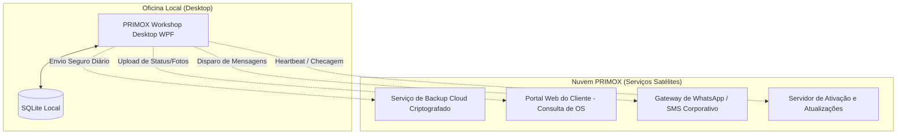

# PRIMOX WORKSHOP — B5.0
## ROADMAP DE SERVIÇOS EM NUVEM E COMPATIBILIDADE SAAS

**Estratégia:** Desktop-First Local com Serviços Híbridos Opcionais  
**Status do Roadmap:** **PLANEJAMENTO DE LONGO PRAZO (TRILHA B / PÓS-RELEASE)**

---

### 1. Diretriz Estratégica: Por que o PRIMOX é Desktop-First?

No mercado automotivo real (oficinas de reparação, centros de linha pesada, pátios de transportadoras):
1. **Conectividade Instável:** Muitas oficinas operam em galpões industriais ou beiras de rodovias com sinal 4G/5G oscilante. O software não pode travar ou congelar porque a internet caiu no meio de uma ordem de serviço.
2. **Velocidade e Produtividade:** A abertura de telas, leitura de PDFs de catálogo e resposta do leitor de código de barras devem ser instantâneas (<10ms).
3. **Privacidade de Dados:** A oficina tem a garantia de que seu cadastro de clientes e margens de lucro estão armazenados no próprio estabelecimento.

---

### 2. Arquitetura Alvo de Serviços Híbridos em Nuvem

O roadmap divide os serviços em nuvem em componentes satélites independentes, sem transformar o núcleo desktop em web:

---

### 3. Fases de Implementação Cloud

| Serviço Cloud | Fase Prevista | Dependências Técnicas | Benefício ao Cliente |
| :--- | :---: | :--- | :--- |
| **Backup Automático em Nuvem** | **B6 / B7** | Storage AWS S3 / Azure Blob + Criptografia AES-256 | Proteção total contra queima de HD ou roubo na oficina |
| **Servidor de Licenciamento & Update** | **B7** | API ASP.NET Core + PostgreSQL | Atualização automática sem necessidade de técnico no local |
| **Portal Web do Cliente (DVI/OS)**| **B8 (Trilha B)**| WebApp React/Next.js + Bucket de Imagens CDN | Cliente aprova orçamento e vê fotos do DVI no celular |
| **Gateway WhatsApp Oficial** | **B8 (Trilha B)**| Meta Cloud API / Provedor BSP Z-API ou Gupshup | Envio de status de OS diretamente pelo WhatsApp |
| **Sincronização Multi-Filial** | **B8 (Trilha B)**| Engine de Replicação Bidirecional / Sync Agent | Rede de oficinas compartilha estoque e histórico de clientes |
