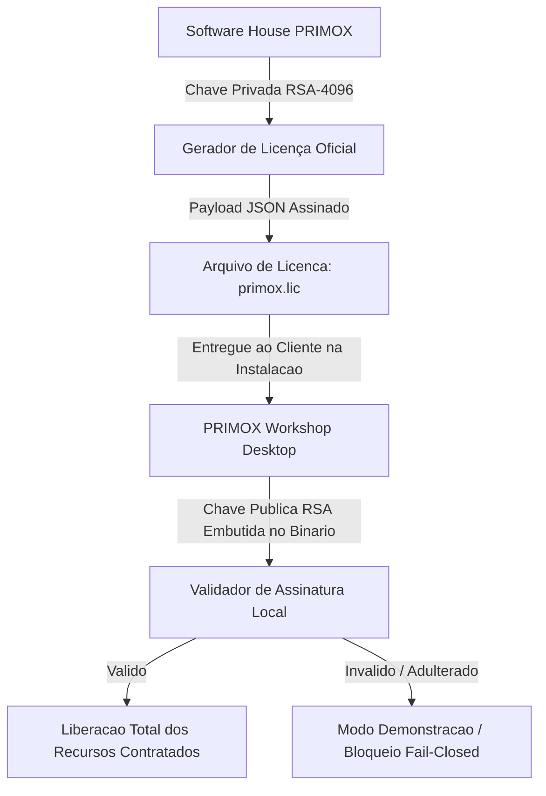

# PRIMOX WORKSHOP — B5.0
## PLANO DE ARQUITETURA E RELEASE DE LICENCIAMENTO COMERCIAL

**Módulo:** Gestão de Licenças e Proteção de Propriedade Intelectual  
**Tecnologia:** Criptografia Assimétrica RSA-4096 / Ed25519 + Assinatura Digital  
**Status:** **ARQUITETURA DEFINIDA (SEM DEPENDÊNCIA DE SERVIDOR FAKE)**

---

### 1. Diagnóstico do Scaffold Atual e Objetivo de Transição

- **Estado Atual (Fase B4):** O sistema possui o `LicenseService` com a flag de segurança `IsCommercialScaffoldOnly = true`, operando em modo local fail-closed com verificação sintática e permissões ativas.
- **Diretriz de Transição:** A versão comercial v1.0 **NÃO criará um servidor SaaS fake**. 
  A arquitetura é projetada em **2 Níveis Consecutivos**:
  - **Nível 1 (Offline Standalone Cryptographic License):** Licença assinada digitalmente pela software house, entregue como arquivo `.lic` importado na instalação.
  - **Nível 2 (Online Heartbeat Activation Server):** Ativação pela internet com verificação periódica (Fase B7/B8).

---

### 2. Arquitetura da Licença Offline Criptográfica (Nível 1 - v1.0)

O PRIMOX v1.0 utiliza o modelo de **Licença Assinada por Chave Assimétrica Privada**:



#### Estrutura do Payload da Licença (`primox.lic`):
```json
{
  "LicenseId": "LIC-2026-PRX-00842",
  "Customer": {
    "CNPJ": "12.345.678/0001-90",
    "RazaoSocial": "AUTO ELETRICA CENTRAL LTDA",
    "Email": "financeiro@autoeletricacentral.com.br"
  },
  "HardwareBinding": {
    "MotherboardUuidHash": "A8F1C3E0...B4D1",
    "CpuIdHash": "7D2E...88F0"
  },
  "Plan": {
    "Type": "COMMERCIAL_WORKSHOP_HEAVY",
    "MaxWorkstations": 3,
    "ExpiresAt": "2027-09-30T23:59:59Z",
    "Modules": [
      "CLIENT_VEHICLE_360",
      "ORCAMENTOS_OS",
      "ESTOQUE_CATALOGO",
      "FINANCEIRO_COMPLETO",
      "AUTO_ELETRICA_TECH_HEAVY_24V",
      "DVI_INSPECTION_LOCAL",
      "POS_VENDA_GARANTIAS"
    ]
  },
  "Signature": "MEQCID...AssinaturaDigitalRSA4096EmBase64..."
}
```

---

### 3. Vínculo de Hardware (Hardware Binding)

Para prevenir pirataria por cópia indiscriminada da pasta de instalação:
1. O aplicativo calcula o `HardwareFingerprint` do computador mestre combinando:
   - UUID da Placa-Mãe (via WMI / `Win32_BaseBoard.SerialNumber`)
   - Identificador do Processador (via `Win32_Processor.ProcessorId`)
   - Hash SHA-256 dos componentes.
2. A licença é gerada vinculada ao hash da máquina instalada.
3. Permite tolerância de troca de componentes menores (memória, placa de vídeo, disco secundário) sem invalidação acidental.

---

### 4. Período de Graça e Tolerância Offline (Grace Period)

- **Validade do Token Offline:** 365 dias para licença anual, ou renovação mensal programada.
- **Tolerância a Relógio Adulterado:** O software monitora timestamps crescentes no banco SQLite (`AuditLog`, `EventosOS`). Se a data do sistema for atrasada artificialmente para tentar burlar a expiração, o sistema entra em alerta de inconsistência temporal.
- **Grace Period Operacional:** Ao atingir a data de expiração, a oficina tem **15 dias de período de tolerância operacional** com aviso diário ao gestor antes de travar a emissão de novas ordens de serviço, garantindo que o negócio da oficina nunca pare de forma abrupta.
