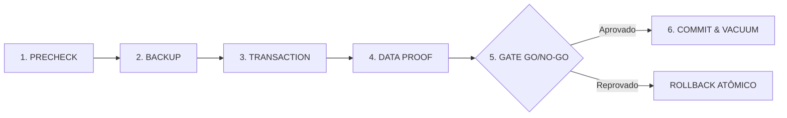

# PRIMOX WORKSHOP — B5.0
## PLANO DE RELEASE E MIGRAÇÃO FÍSICA DE MONEY (SQLITE)

**Objetivo:** Transição segura da representação de valores monetários de ponto flutuante (`REAL`) para centavos inteiros (`INTEGER CentsV1`) no banco de dados SQLite.  
**Ambiente:** Homologação Operacional / Base de Produção sob Gate Rígido  
**Status do Plano:** **ESPECIFICADO (NÃO EXECUTAR NESTA FASE)**

---

### 1. Diagnóstico do Estado Atual

1. **Camada de Aplicação:** A arquitetura do PRIMOX Workshop já opera com precisão total através do componente `MoneyIO`, `MoneyCents` e `decimal` em C#, com testes automatizados garantindo arredondamento bancário (`MidpointRounding.AwayFromZero`) e isolamento de centavos extremos.
2. **Camada de Armazenamento (SQLite):**
   - As tabelas financeiras existentes (`Orcamentos`, `OrdensServico`, `ContasPagar`, `ContasReceber`, `MovimentacoesFinanceiras`) armazenam valores originalmente como `REAL`.
   - A leitura e escrita em tempo de execução são mediadas pelo `MoneyIO`, prevenindo distorções no dia a dia da oficina.
3. **Decisão Arquitetural B4/B5:** A migração física das colunas para `INTEGER` **permanece BLOQUEADA no banco de produção** para evitar qualquer risco de indisponibilidade ou corrupção de dados históricos.

---

### 2. Arquitetura do Utilitário de Migração

A migração física definitiva só poderá ser executada através de um utilitário dedicado (`DbMigrationTool`) operando sob um protocolo formal de **6 Estágios**:

#### Estágio 1: PRECHECK (Inspeção Prévia)
- Verifica permissão exclusiva de acesso ao arquivo `.db`.
- Executa `PRAGMA integrity_check` e `PRAGMA foreign_key_check`.
- Calcula o hash SHA-256 da base original.
- Registra a contagem de registros e a soma monetária de controle de cada tabela:
  `SUM(CAST(ROUND(Valor * 100) AS INTEGER))`

#### Estágio 2: BACKUP (Cópia Snapshot Imutável)
- Cria cópia física timestamped: `primoauto_pre_money_mig_<DATA>.db`.
- Valida integridade da cópia recém-criada via hash e checagem SQLite.

#### Estágio 3: TRANSACTION (Migração Estruturada)
- Abertura de transação única `BEGIN IMMEDIATE TRANSACTION`.
- Para cada tabela alvo:
  1. Criação de coluna temporária `ValorCents INTEGER`.
  2. Migração segura com conversão determinística:
     `UPDATE Tabela SET ValorCents = CAST(ROUND(Valor * 100.0) AS INTEGER);`
  3. Validação de nulos (`COALESCE(ValorCents, 0)`).

#### Estágio 4: DATA PROOF (Validação Linha a Linha)
- Comparação de 100% dos registros:
  `ABS((Valor * 100.0) - ValorCents) > 0.001`
- Se qualquer divergência for detectada: aborta imediatamente.
- Validação das somas agregadas (soma antiga vs soma nova).

#### Estágio 5: GATE GO / NO-GO
- Script automático emite relatório de conferência.
- Se houver divergência de 1 centavo: **NO-GO (Rollback imediato)**.
- Se todas as somas coincidirem perfeitamente: **GO**.

#### Estágio 6: COMMIT & REORGANIZAÇÃO
- Atualização do schema definitivo.
- `PRAGMA user_version = 2` (indicador de base em CentsV1).
- `COMMIT` da transação.
- `VACUUM` e `ANALYZE` do banco.

---

### 3. Matriz de Tabelas e Colunas Alvo da Migração

| Tabela SQLite | Coluna Atual (`REAL`) | Nova Coluna (`INTEGER Cents`) | Tipo de Dado |
| :--- | :--- | :--- | :--- |
| `Orcamentos` | `ValorTotal`, `Desconto` | `ValorTotalCents`, `DescontoCents` | Centavos Inteiros |
| `OrcamentoItens` | `PrecoUnitario`, `Subtotal` | `PrecoUnitarioCents`, `SubtotalCents`| Centavos Inteiros |
| `OrdensServico` | `ValorTotal`, `Desconto` | `ValorTotalCents`, `DescontoCents` | Centavos Inteiros |
| `OrdemServicoItens` | `ValorUnitario` | `ValorUnitarioCents` | Centavos Inteiros |
| `ContasPagar` | `Valor`, `ValorPago` | `ValorCents`, `ValorPagoCents` | Centavos Inteiros |
| `ContasReceber` | `Valor`, `ValorRecebido` | `ValorCents`, `ValorRecebidoCents` | Centavos Inteiros |
| `MovimentacoesFinanceiras` | `Valor` | `ValorCents` | Centavos Inteiros |
| `Produtos` | `PrecoCusto`, `PrecoVenda`| `PrecoCustoCents`, `PrecoVendaCents`| Centavos Inteiros |

---

### 4. Critério de Execução
A migração física em produção só será realizada na **Fase B7**, precedida de ensaio completo em homologação e homologação pelo piloto comercial.
