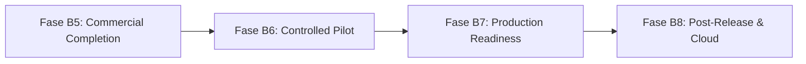

# PRIMOX WORKSHOP — B5.0
## ROADMAP ESTRATÉGICO DE RELEASE: FASES B5, B6, B7 E B8

**Visão Geral:** Planejamento por dependências técnicas e gates formais de validação  
**Status do Roadmap:** **APROVADO**

---

### 1. Visão Geral das Fases

---

### 2. Detalhamento por Fase e Critérios de Transição

#### FASE B5: COMMERCIAL HARDENING & ENGENHARIA DE RELEASE (Atual / Imediata)
- **Objetivo:** Preparar todo o ferramental operacional que antecede a instalação física na primeira oficina parceira.
- **Entregas Principais:**
  - B5.0: Descoberta de prontidão comercial e arquitetura de release (Concluída).
  - B5.1: Interface gráfica dedicada para Checklist Técnico Multiponto e Pós-Venda.
  - B5.2: Utilitário de migração de banco com rehearsal completo em homologação.
  - B5.3: Empacotamento oficial do instalador Inno Setup e validação de runtime .NET 10.
- **Gate de Saída:** Build Release, 417+ testes automatizados, UI Smoke APROVADO, instalador funcional em máquina limpa.

#### FASE B6: PILOTO COMERCIAL CONTROLADO (Oficina Parceira)
- **Objetivo:** Operação assistida em 1 oficina real durante 30 dias com base de dados operacional isolada.
- **Entregas Principais:**
  - Implantação e treinamento da equipe da oficina.
  - Acompanhamento diário de abertura de OS, ordens de serviço e baixas financeiras.
  - Coleta contínua de feedback de ergonomia e correção cirúrgica de inconsistências.
- **Gate de Saída:** 30 dias sem falhas críticas, zero corrupção de banco, aprovação formal do gestor da oficina.

#### FASE B7: PRODUCTION READINESS & HOMOLOGAÇÃO FISCAL
- **Objetivo:** Habilitação de emissão fiscal própria e liberação comercial em larga escala.
- **Entregas Principais:**
  - Homologação formal com Webservices SEFAZ estaduais em ambiente de teste com certificado digital real.
  - Execução controlada da migração física de Money na base de produção sob gate atômico.
  - Ativação do licenciamento oficial com assinatura assimétrica.
- **Gate de Saída:** Emissão bem-sucedida de NF-e/NFC-e autorizada pela SEFAZ, base de dados 100% íntegra em CentsV1.

#### FASE B8: PÓS-RELEASE & SERVIÇOS EM NUVEM (Trilha B)
- **Objetivo:** Diferenciais de mobilidade e conectividade corporativa.
- **Entregas Principais:**
  - Portal do Cliente para acompanhamento de OS e aprovação remota de DVI.
  - Aplicativo mobile para mecânicos no pátio.
  - Sincronização multi-filial para redes de oficinas.
