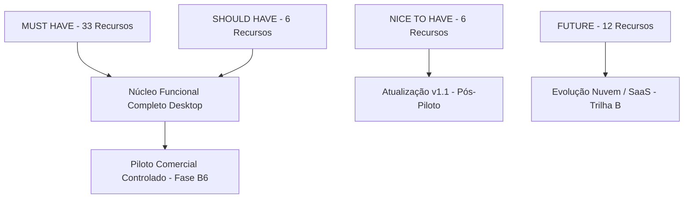

# PRIMOX WORKSHOP — B5.0
## ESCOPO REAL DE RELEASE COMERCIAL (MVP OPERACIONAL)

**Data:** 2026-09-24  
**Status:** **DEFINIDO**

---

### 1. Critério de Classificação do MVP Comercial

Para que uma oficina mecânica/autoelétrica opere diariamente sem interrupções e sem depender de processos em papel ou planilhas paralelas, o software deve garantir a integridade do fluxo de atendimento e prestação de serviço.

A classificação adota o modelo de priorização operacional:
- **MUST HAVE (Essencial para Operação Diária):** Sem isso a oficina não consegue atender, diagnosticar, cobrar ou controlar seu estoque.
- **SHOULD HAVE (Recomendado para Eficiência):** Agiliza o trabalho e reduz erros manuais, mas a oficina consegue operar provisoriamente com alternativa manual.
- **NICE TO HAVE (Conveniência e Diferenciação):** Recursos modernos de comodidade para clientes e gestores.
- **FUTURE (Evoluções Pós-Piloto):** Demandam infraestrutura externa (cloud, telecom ou adquirentes).

---

### 2. Mapeamento do Fluxo Operacional de Ponta a Ponta

| Etapa do Fluxo | Funcionalidade Associada | Classificação | Justificativa Operacional |
| :--- | :--- | :---: | :--- |
| **1. Recepção & Cadastro** | Cadastro de Clientes com Validação CPF/CNPJ | **MUST HAVE** | Identificação fiscal e de contato indispensável |
| | Termo de Consentimento LGPD | **MUST HAVE** | Conformidade legal básica de custódia de dados |
| | Cadastro de Veículos Leves e Pesados (12V/24V) | **MUST HAVE** | Objeto central de atendimento na oficina |
| | Prontuário Técnico Elétrico (17 campos) | **MUST HAVE** | Diferencial técnico da autoelétrica |
| **2. Triagem & Inspeção** | DVI Inspecão Visual Digital Local | **SHOULD HAVE** | Registro fotográfico e avarias de entrada do pátio |
| | DVI Aprovação Remota Web | **FUTURE** | Demanda servidor web e link externo para cliente |
| **3. Proposta & Aprovação** | Elaboração de Orçamento (Peças + Mão de Obra) | **MUST HAVE** | Definição formal de valores e condições |
| | Token de Aprovação do Orçamento | **MUST HAVE** | Registro formal de autorização do proprietário |
| | Conversão Automática Orçamento → OS | **MUST HAVE** | Eliminação completa de retrabalho e redigitação |
| **4. Execução Técnica** | Abertura e Gestão de Ordem de Serviço | **MUST HAVE** | Controle operacional da oficina e do mecânico |
| | Diagnóstico Técnico Estruturado (D01-D06) | **MUST HAVE** | Guias de teste elétrico (Partida, Carga, Fuga, Bateria) |
| | Registro de Medições (V, A, CCA, Queda) | **MUST HAVE** | Evidência técnica auditável do defeito |
| | Teste Pós-Reparo com Delta Calculado | **MUST HAVE** | Prova objetiva de eficácia do conserto elétrico |
| | Checklist Técnico da OS | **SHOULD HAVE** | Inspeção multiponto para frotas e linha pesada |
| **5. Suprimentos & Peças** | Requisição e Baixa Automática de Estoque | **MUST HAVE** | Kardex atualizado e prevenção de extravios |
| | Catálogo Técnico e Aplicação Veicular | **MUST HAVE** | Identificação correta de componentes alternativos |
| | Importação de XML de NF-e de Compra | **SHOULD HAVE** | Entrada expressa de mercadorias no estoque |
| | Endereçamento Físico (Gaveteiro) | **NICE TO HAVE** | Otimização do tempo de localização de peças pequenas |
| **6. Entrega & Faturamento**| Conclusão da OS com Baixa Financeira | **MUST HAVE** | Liberação do veículo e apuração de custos |
| | Caixa Operacional (Turno, Sangria, Suprimento)| **MUST HAVE** | Fechamento diário de valores em dinheiro/pix |
| | Contas a Receber e Parcelamento | **MUST HAVE** | Gestão de prazos e crédito de clientes |
| | Contas a Pagar e Despesas Operacionais | **MUST HAVE** | Controle financeiro do estabelecimento |
| **7. Relacionamento** | Histórico Técnico Unificado (Vehicle360) | **MUST HAVE** | Rastreabilidade de intervenções anteriores |
| | Histórico Comercial Unificado (Client360) | **MUST HAVE** | Fidelização e visão global de consumo |
| | Pós-Venda (Garantias, Retornos e Revisões) | **MUST HAVE** | Prevenção de retrabalho e retenção de frota |
| | Notificação Automática por SMS/WhatsApp API | **FUTURE** | Exige integração oficial e custos de mensageria |
| | Link Manual WhatsApp (wa.me) | **SHOULD HAVE** | Envio de mensagens pré-formatadas sem custo |

---

### 3. Matriz de Priorização do Release

### 4. Conclusão do Escopo de Release
O PRIMOX Workshop possui **33 recursos MUST HAVE plenamente implementados e validados no backend e desktop**. A oficina consegue executar 100% de sua rotina operacional local com o software, mantendo backup regular e controle de acesso estrito.
