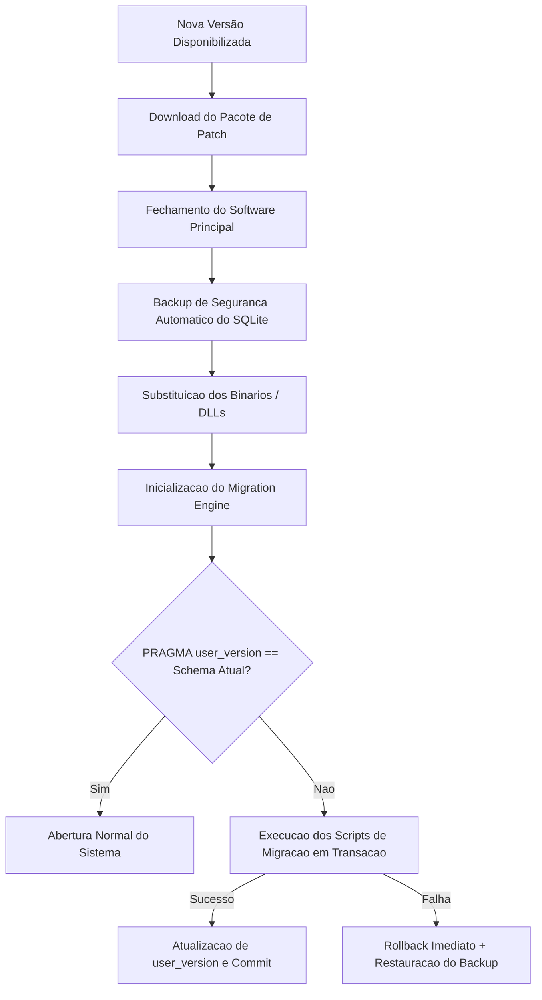

# PRIMOX WORKSHOP — B5.0
## ESTRATÉGIA DE ATUALIZAÇÃO CONTÍNUA E VERSIONAMENTO DE BANCO

**Escopo:** Transição entre versões (v1.0 → v1.0.1 → v1.1 → v2.0)  
**Status:** **DEFINIDO**

---

### 1. Ciclo de Vida de Atualização do Software

O processo de atualização do PRIMOX Workshop segue uma cadeia de segurança determinística para assegurar zero perda de dados:

---

### 2. Versionamento de Banco de Dados (`PRAGMA user_version`)

O SQLite disponibiliza nativamente o registrador `PRAGMA user_version` (inteiro de 32 bits), utilizado pelo PRIMOX para controle de migrações:

| Versão do Schema (`user_version`) | Versão do PRIMOX | Alterações de Estrutura |
| :---: | :---: | :--- |
| **0** | Legado | Criação inicial das tabelas por script dinâmico |
| **1** | B2 / B3 / B4 | Tabelas estruturadas com 17 campos elétricos, Pós-venda e D01-D06 |
| **2** | B5 / B6 (Piloto) | Tabelas de Checklist Técnico (`ChecklistTecnicoOS`, `ChecklistTecnicoItem`) |
| **3** | B7 (Produção) | Migração física definitiva de valores monetários para `INTEGER CentsV1` |
| **4** | B8 | Tabelas de sincronização de filas offline/online |

---

### 3. Protocolo de Rollback Automático em Caso de Erro de Atualização

Se durante a inicialização pós-atualização ocorrer qualquer erro de inicialização do SQLite ou falha de integridade:
1. O processo de migração interrompe a transação (`ROLLBACK`).
2. O backup criado no início da rotina (`primoauto_pre_update_<versao>.db`) é restaurado no local original.
3. O executável anterior é mantido como fallback (`PrimoAutoEletrica.exe.bak`).
4. Um log de diagnóstico detalhado é gerado em `%LOCALAPPDATA%\PrimoAutoEletrica\Logs\update_error.log`.
5. O usuário recebe aviso claro orientando o contato com o suporte técnico.
