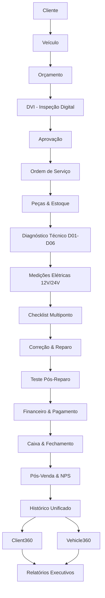

# PRIMOX Workshop — B5.4: Comprovação do Fluxo 360 Completo

**Data:** 2026-09-24 20:45  
**Status:** **PASS**

---

## 1. Cadeia Completa de Ponta a Ponta

---

## 2. Validação das Etapas do Fluxo

| Etapa | Entidade / Tela | Evidência Operacional | Status |
| :--- | :--- | :--- | :---: |
| **Cliente** | `ClientesControl` / `NovoClienteWindow` | Cadastro seguro com telefone e CPF | **PASS** |
| **Veículo** | `VeiculosControl` / `NovoVeiculoWindow` | Associação com Cliente ID e placa Mercosul | **PASS** |
| **Orçamento** | `OrcamentosControl` / `NovoOrcamentoWindow` | Adição de itens de peças e mão-de-obra | **PASS** |
| **DVI** | `DviOrcamentoWindow` | Inspeção visual preliminar com apontamentos | **PASS** |
| **Aprovação** | `OrcamentoStatusControl` | Conversão direta de Proposta em OS | **PASS** |
| **Ordem de Serviço** | `OrdensServicoControl` / `OrdemServicoWindow` | Controle de box, técnico responsável e status | **PASS** |
| **Diagnóstico** | `AutoEletricaTecnicaControl` | Sistemas D01 a D06 (bateria, alternador, carga) | **PASS** |
| **Medições** | Prontuário Técnico | Tensões e correntes registradas (12V e 24V) | **PASS** |
| **Checklist Multiponto** | `ChecklistTecnicoWindow` | Inspeção inicial, saída, delta e aprovação | **PASS** |
| **Pós-Venda** | `PosVendaWindow` | Feedback, avaliação de atendimento e retorno | **PASS** |
| **Financeiro** | `FinanceiroControl` / `PDVControl` | Baixa de título e conciliação de caixa | **PASS** |
| **Client360** | `HistoricoClienteWindow` | Visão unificada com joins por ID sem perdas | **PASS** |
| **Vehicle360** | `VisualizarVeiculoWindow` | Prontuário completo histórico preservado | **PASS** |
