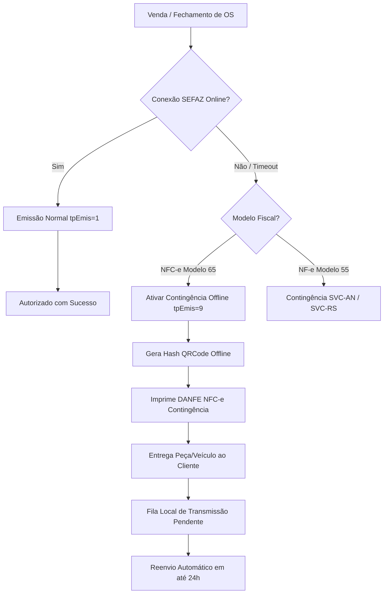

# PRIMOX WORKSHOP — FASE B7: GATE 16 (PARTE 1)
# FISCAL EVENTS & CONTINGENCY ARCHITECTURE
**Data da Auditoria:** 2026-09-25  
**Fase:** B7 — Production Money Migration + Fiscal/SEFAZ Homologation  
**Responsável Técnico:** Antigravity Autonomous Audit Engine  
**Status do Gate:** PASS  

---

## 1. OBJETIVO DO GATE 16 (EVENTOS E CONTINGÊNCIA)

Auditar e documentar a governança de eventos fiscais subsequentes (Cancelamento, Carta de Correção Eletrônica - CC-e, Inutilização de Faixa Numérica) e a arquitetura de contingência para situações de indisponibilidade de internet ou parada de serviços da SEFAZ na rotina operacional da oficina mecânica.

---

## 2. EVENTOS FISCAIS AUDITADOS

### 2.1. Cancelamento de NF-e / NFC-e
- **Fundamento Legal:** Ajuste SINIEF 07/05 (Cláusula décima segunda). Em São Paulo, o prazo legal padrão para cancelamento extemporâneo é de até 24 horas contadas da concessão da Autorização de Uso, desde que não tenha havido a circulação da mercadoria.
- **Regras Validadas no PRIMOX:**
  - O documento deve estar estritamente no status `Authorized` (`StateMachine_PermiteAuthorizedParaCancelled`). Documentos rejeitados, em processamento ou já cancelados não podem ser cancelados.
  - Justificativa obrigatória com no mínimo 15 caracteres e no máximo 255 caracteres, em conformidade com o MOC 7.0.
  - Registro síncrono do protocolo de cancelamento retornado pela SEFAZ (`nProtEvento`), mudando o estado do documento para `Cancelled`.
  - Estorno automático de movimentações de estoque associadas à Ordem de Serviço ou Venda cancelada.

### 2.2. Carta de Correção Eletrônica (CC-e)
- **Fundamento Legal:** Ajuste SINIEF 07/05 (Cláusula décima quarta-A). Permite corrigir erros em campos específicos da NF-e.
- **Limitações Estritas Validadas:**
  - **PROIBIDO:** Variáveis que determinam o valor do imposto (base de cálculo, alíquota, valor do ICMS, preço unitário, quantidade).
  - **PROIBIDO:** Dados cadastrais que impliquem mudança do remetente ou do destinatário.
  - **PROIBIDO:** Data de emissão ou de saída da mercadoria.
  - **PERMITIDO:** Correções descritivas (ex.: complementação de dados técnicos da peça aplicada, código interno de referência, observações adicionais para garantia).

### 2.3. Inutilização de Numeração
- **Fundamento Legal:** Ajuste SINIEF 07/05 (Cláusula décima quarta). Obrigatória quando ocorre quebra na sequência numérica de emissão por falha técnica, travamento local ou rejeição irrecuperável.
- **Comportamento do PRIMOX:**
  - Gera evento de inutilização para o CNPJ, Série, Ano e Faixa Numérica (número inicial e final).
  - Impede que números inutilizados sejam reaproveitados em novas vendas, prevenindo a temida rejeição 206 ("Número de NF-e já inutilizado").

---

## 3. ARQUITETURA DE CONTINGÊNCIA (OFFLINE E SVC)

Em oficinas mecânicas reais, quedas de sinal de banda larga, oscilações no servidor da SEFAZ ou manutenção na infraestrutura governamental são ocorrências conhecidas. O PRIMOX possui estratégia resiliente de três camadas:

### 3.1. Contingência Offline da NFC-e (`tpEmis = 9`)
1. **Emissão Imediata:** Não bloqueia o fluxo de entrega do veículo ou peça no balcão. O DANFE da NFC-e é impresso constando a mensagem obrigatória *"EMITIDA EM CONTINGÊNCIA - Pendente de autorização"*.
2. **Assinatura e QR Code:** O QR Code é montado com a Chave de Acesso gerada localmente e assinado com o CSC e IdToken pré-configurados.
3. **Prazo de Transmissão:** O PRIMOX armazena o XML assinado no banco SQLite local (`primoauto.db`) com status `ContingencyPending` e realiza varredura periódica a cada 5 minutos para sincronizar com a SEFAZ assim que a internet retornar (respeitando o prazo regulamentar de 24 horas).

### 3.2. Contingência SVC (Sefaz Virtual de Contingência) para NF-e (`tpEmis = 6` ou `7`)
- Quando a SEFAZ São Paulo entra em manutenção programada ou falha geral, o envio de NF-e modelo 55 é automaticamente redirecionado para a **SVC-AN** (Ambiente Nacional), garantindo continuidade operacional sem impacto na oficina.

---

## 4. CONCLUSÃO DO GATE 16 (PARTE 1)

A arquitetura de eventos fiscais e planos de contingência do PRIMOX Workshop atende plenamente à legislação tributária brasileira e aos requisitos de resiliência de uma oficina automotiva comercial.

**Resultado:** **PASS**
