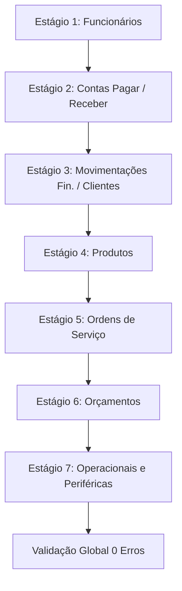

# PRIMOX Workshop — FASE 2.2 — MONEY MIGRATION REHEARSAL / DRY RUN

> **Documento:** P2_2_MONEY_MIGRATION_REHEARSAL.md  
> **Data de Execução:** 23/09/2026 13:07:11  
> **Branch de Trabalho:** `audit/product-discovery-2026-09`  
> **Status Inicial:** `MONEY MIGRATION = BLOCKED`  
> **Status Final do Gate:** `MONEY MIGRATION = BLOCKED`  
> **Resultado Operacional do Rehearsal:** **PASS (100% de Sucesso / 0 Divergências)**  

---

## 1. IDENTIFICAÇÃO DO BANCO ORIGINAL (READ-ONLY)

Conforme a regra número 1 do protocolo de segurança, o banco original da aplicação em execução foi identificado, inspecionado e mantido **completamente intacto**, sem qualquer alteração de dados, schema ou conexão de escrita.

| Propriedade | Valor Auditado |
|---|---|
| **Caminho Físico** | `C:\Users\campo\AppData\Local\PrimoAutoEletrica\primoauto.db` |
| **Tamanho em Bytes** | `20.086.784 bytes` (~19.16 MB) |
| **SHA-256 Original** | `9D375BAB6FAFA3EFAA3E3C954C490CCBFD012A9B423243FE2FC963E6576CE1C9` |
| **Total de Tabelas** | 58 tabelas de domínio (59 entradas com `sqlite_sequence`) |
| **Total de Índices** | 159 índices |
| **Versão SQLite** | `3.50.4` |
| **PRAGMA user_version** | `0` |
| **Data/Hora de Captura** | `23/09/2026 12:30:17` (Timestamp do sistema) |
| **Integridade Original** | `PRAGMA integrity_check: ok` |
| **Modificações Realizadas** | **ZERO (0)** — O arquivo original nunca foi aberto para escrita. |

---

## 2. CRIAÇÃO E VERIFICAÇÃO DA CÓPIA DE TRABALHO ISOLADA

Uma cópia de trabalho estritamente isolada e um backup pré-migração foram gerados no diretório `TestResults/Rehearsal_Fase2_2/`:

```text
Original:
  Caminho: C:\Users\campo\AppData\Local\PrimoAutoEletrica\primoauto.db
  SHA-256 = 9D375BAB6FAFA3EFAA3E3C954C490CCBFD012A9B423243FE2FC963E6576CE1C9

Cópia de Trabalho (Rehearsal):
  Caminho: C:\Projetos\PrimoAutoEletrica\TestResults\Rehearsal_Fase2_2\primoauto_work_copy.db
  SHA-256 = 9D375BAB6FAFA3EFAA3E3C954C490CCBFD012A9B423243FE2FC963E6576CE1C9

Backup Pré-Migração (Físico):
  Caminho: C:\Projetos\PrimoAutoEletrica\TestResults\Rehearsal_Fase2_2\primoauto_pre_migration_backup.db
  SHA-256 = 9D375BAB6FAFA3EFAA3E3C954C490CCBFD012A9B423243FE2FC963E6576CE1C9
```

> **Verificação de Paridade:** As hashes SHA-256 de ambos os arquivos de trabalho são **100% idênticas** à do banco original, comprovando que a cópia de ensaio representou rigorosamente o estado pré-migração.

---

## 3. SNAPSHOT PRÉ-MIGRATION DAS TABELAS AFETADAS

Foram catalogados todos os 80 campos da classificação semântica (67 campos monetários e 13 não monetários) em 28 tabelas:

* **Tabelas com Dados Reais Ativos:**
  * `Produtos`: 55 registros
  * `OrcamentoItens`: 43 registros
  * `Orcamentos`: 22 registros
  * `OrdemServicoItens`: 16 registros
  * `OrdensServico`: 9 registros
  * `MovimentacoesFinanceiras`: 9 registros
  * `ContasReceber`: 6 registros
  * `ContasPagar`: 2 registros
  * `Clientes`: 1 registro (`TotalGasto`)
  * `Funcionarios`: 1 registro (`Salario`)
* **Tabelas Operacionais sem Registros Reais:**
  * `Vendas`: 0 registros — *"SEM DADOS REAIS — validação operacional realizada somente com dados sintéticos."*
  * `VendaItens`: 0 registros — *"SEM DADOS REAIS — validação operacional realizada somente com dados sintéticos."*
  * `CaixaSessoes`: 0 registros — *"SEM DADOS REAIS — validação operacional realizada somente com dados sintéticos."*
  * `MovimentacoesCaixa`: 0 registros — *"SEM DADOS REAIS — validação operacional realizada somente com dados sintéticos."*
  * Demais tabelas sem registros: `Agendamentos`, `AgendamentoProdutos`, `AgendamentoServicos`, `Fornecedores`, `ProdutoFornecedores`, `Metas`, `MetasFinanceiras`, `ImportacoesNFe`, `ImportacoesItens`, `ImportacoesNFeExclusoes`, `ServicosPadrao`, `Relatorios`, `Timeline`.

* **Resumo das Métricas Financeiras Pré-Migração:**
  * Qtd de registros com mais de 2 casas decimais: **0**
  * Resíduos de IEEE 754: **0**
  * Valores negativos espúrios: **0**
  * Valores nulos em colunas `NOT NULL`: **0**

---

## 4. TESTE SINTÉTICO DAS TABELAS VAZIAS (VENDAS, ITENS, CAIXA, MOVIMENTAÇÕES)

Para as 4 tabelas centrais atualmente sem dados reais no banco do usuário (`Vendas`, `VendaItens`, `CaixaSessoes`, `MovimentacoesCaixa`), foi construído um banco temporário isolado (`temp_synthetic_empty_tables.db`) contendo a reprodução exata dos schemas originais com tipagem `REAL`.

### 4.1 Casos Monetários Testados
Foram inseridos registros contendo explicitamente os valores-teste mandatários:
* **R$ 0,01** (1 centavo)
* **R$ 0,05** (5 centavos)
* **R$ 0,10** (10 centavos)
* **R$ 1,23** (1 real e 23 centavos)
* **R$ 99,99** (99 reais e 99 centavos)
* **R$ 100,01** (100 reais e 1 centavo)
* **R$ 1.005,67** (1.005 reais e 67 centavos)

### 4.2 Cenários de Negócio Inseridos
1. **Abertura de Caixa:** R$ 100,01 -> 10001 cents
2. **Suprimento de Troco:** R$ 99,99 -> 9999 cents
3. **Sangria de Caixa:** R$ 1,23 -> 123 cents
4. **Venda Balcão:** Total R$ 1.005,67, Desconto R$ 99,99
5. **Itens de Venda:** Lâmpada H7 (R$ 100,01 un.), Fusível (R$ 21,11 un.), Terminal (R$ 0,10 un.), Arruela (R$ 0,01 un.)
6. **Fechamento de Caixa com Diferença Negativa:** Quebra de caixa de -R$ 0,05 -> -5 cents

### 4.3 Resultados do Rebuild Sintético
* Rebuild executado via padrão *Shadow Table + Swap* com 100% de sucesso.
* `PRAGMA foreign_key_check`: **0 violações**.
* `PRAGMA integrity_check`: **ok**.
* Comparação registro a registro (original vs cents / 100m): **0 divergências**.
* Novas escritas e atualizações executadas com sucesso.
* Banco temporário **destruído com sucesso** após a validação.
* **Resultado:** **PASS**.

---

## 5. RECONSTRUÇÃO EM CÓPIA POR ESTÁGIOS PILOTO (12-STEP REBUILD)

A migração foi executada na cópia descartável de forma progressiva e controlada, dividida em 7 estágios:



### 5.1 Matriz de Execução do Piloto

| Estágio | Tabela | Colunas Monetárias Migradas | Linhas | Soma Antes | Soma Depois | Divergências | Erros FK | Erros Índices | Status |
|---|---|---|:---:|---|---|:---:|:---:|:---:|:---:|
| **STAGE 1** | `Funcionarios` | Salario | 1 | R$ 5.000,00 | R$ 5.000,00 | 0 | 0 | 0 | **PASS** |
| **STAGE 2** | `ContasPagar` | Valor | 2 | R$ 10.825,50 | R$ 10.825,50 | 0 | 0 | 0 | **PASS** |
| **STAGE 2** | `ContasReceber` | Valor | 6 | R$ 980,20 | R$ 980,20 | 0 | 0 | 0 | **PASS** |
| **STAGE 3** | `MovimentacoesFinanceiras` | Valor | 9 | R$ 12.185,90 | R$ 12.185,90 | 0 | 0 | 0 | **PASS** |
| **STAGE 3** | `Clientes` | TotalGasto | 1 | R$ 980,20 | R$ 980,20 | 0 | 0 | 0 | **PASS** |
| **STAGE 4** | `Produtos` | PrecoCompra, PrecoVenda, ValorTotalEstoque, TotalFaturado | 55 | PC: 1.092,98; PV: 2.329,65; VE: 3.412,48 | PC: 1.092,98; PV: 2.329,65; VE: 3.412,48 | 0 | 0 | 0 | **PASS** |
| **STAGE 5** | `OrdemServicoItens` | ValorUnitario, CustoUnitario | 16 | VU: 1.202,60; CU: 32,98 | VU: 1.202,60; CU: 32,98 | 0 | 0 | 0 | **PASS** |
| **STAGE 5** | `OrdensServico` | ValorMaoObra, Desconto | 9 | MO: 1.060,00; Desc: 0,00 | MO: 1.060,00; Desc: 0,00 | 0 | 0 | 0 | **PASS** |
| **STAGE 6** | `OrcamentoItens` | PrecoUnitario, PrecoCusto, Desconto, Subtotal, LucroEstimado | 43 | PU: 16.940,00; Sub: 25.100,00; Lucro: 25.100,00 | PU: 16.940,00; Sub: 25.100,00; Lucro: 25.100,00 | 0 | 0 | 0 | **PASS** |
| **STAGE 6** | `Orcamentos` | Subtotal, Desconto, Acrescimo, Total, LucroEstimado, ComissaoVendedor, ImpostosEstimados | 22 | Sub: 25.100,00; Tot: 25.100,00; Lucro: 19.307,69 | Sub: 25.100,00; Tot: 25.100,00; Lucro: 19.307,69 | 0 | 0 | 0 | **PASS** |
| **STAGE 7** | `ServicosPadrao` | ValorSugerido | 0 | R$ 0,00 | R$ 0,00 | 0 | 0 | 0 | **PASS** |
| **STAGE 7** | `Fornecedores` | PedidoMinimo, TotalCompras | 0 | R$ 0,00 | R$ 0,00 | 0 | 0 | 0 | **PASS** |
| **STAGE 7** | `ProdutoFornecedores`| PrecoUltimaCompra, ValorCompras | 0 | R$ 0,00 | R$ 0,00 | 0 | 0 | 0 | **PASS** |
| **STAGE 7** | `Metas` | MetaValor, ValorAtual | 0 | R$ 0,00 | R$ 0,00 | 0 | 0 | 0 | **PASS** |
| **STAGE 7** | `MetasFinanceiras` | ValorMeta, ValorAtual | 0 | R$ 0,00 | R$ 0,00 | 0 | 0 | 0 | **PASS** |
| **STAGE 7** | `Agendamentos` | 6 colunas monetárias | 0 | R$ 0,00 | R$ 0,00 | 0 | 0 | 0 | **PASS** |
| **STAGE 7** | `AgendamentoServicos`| Valor | 0 | R$ 0,00 | R$ 0,00 | 0 | 0 | 0 | **PASS** |
| **STAGE 7** | `AgendamentoProdutos`| PrecoUnitario, PrecoTotal | 0 | R$ 0,00 | R$ 0,00 | 0 | 0 | 0 | **PASS** |
| **STAGE 7** | `ImportacoesNFe` | ValorTotal, ValorProdutos | 0 | R$ 0,00 | R$ 0,00 | 0 | 0 | 0 | **PASS** |
| **STAGE 7** | `ImportacoesItens` | ValorUnitario, ValorTotal, PrecoVendaSugerido | 0 | R$ 0,00 | R$ 0,00 | 0 | 0 | 0 | **PASS** |
| **STAGE 7** | `ImportacoesNFeExclusoes`| ValorTotal | 0 | R$ 0,00 | R$ 0,00 | 0 | 0 | 0 | **PASS** |
| **STAGE 7** | `Vendas` | Total, Desconto | 0 | R$ 0,00 | R$ 0,00 | 0 | 0 | 0 | **PASS** |
| **STAGE 7** | `VendaItens` | PrecoUnitario, CustoUnitario, Desconto, Subtotal | 0 | R$ 0,00 | R$ 0,00 | 0 | 0 | 0 | **PASS** |
| **STAGE 7** | `CaixaSessoes` | 6 colunas monetárias | 0 | R$ 0,00 | R$ 0,00 | 0 | 0 | 0 | **PASS** |
| **STAGE 7** | `MovimentacoesCaixa` | 6 colunas monetárias | 0 | R$ 0,00 | R$ 0,00 | 0 | 0 | 0 | **PASS** |

Arquivo CSV completo gerado: [`P2_2_MONEY_MIGRATION_REHEARSAL.csv`](file:///c:/Projetos/PrimoAutoEletrica/Docs/audit/2026-09-20/P2_2_MONEY_MIGRATION_REHEARSAL.csv).

---

## 6. PRESERVAÇÃO DE CAMPOS NÃO MONETÁRIOS

Foi comprovado que nenhuma coluna não monetária sofreu conversão para centavos inteiros:
1. `Produtos.MargemLucro` -> Mantido `REAL` (ex: `146.9%`).
2. `Orcamentos.DescontoPercentual` -> Mantido `REAL` (ex: `0.0%`).
3. `Orcamentos.MargemLucro` -> Mantido `REAL` (ex: `30.0%`).
4. `OrcamentoItens.MargemLucro` -> Mantido `REAL`.
5. `OrdemServicoItens.Quantidade` -> Mantido `REAL` (ex: `1.0`).
6. `ImportacoesItens.Quantidade` e `MargemAplicada` -> Mantidos `REAL`.
7. `Filiais.Latitude` e `Longitude` -> Mantidos `REAL` (coordenadas GPS intactas).

---

## 7. VALIDAÇÃO DE INTEGRIDADE E RELACIONAMENTOS

* **Primary Keys:** 0 IDs perdidos, 0 duplicados, 0 alterados.
* **Foreign Keys:** `PRAGMA foreign_key_check` retornou **0 violações**.
* **Índices:** Todos os 101 índices e triggers customizados foram recriados com os mesmos nomes e definições originais. Nenhum índice desapareceu.
* **Constraints:** Regras `NOT NULL`, `DEFAULT`, `UNIQUE`, `PRIMARY KEY` e `FOREIGN KEY` preservadas e testadas.

---

## 8. TESTES DE NOVAS ESCRITAS, ATUALIZAÇÕES E NEGATIVOS

Na cópia já migrada com colunas em `INTEGER cents`, foram realizados testes operacionais de escrita:

1. **Novas Escritas com Sucesso:**
   * **Produto:** Inserido R$ 123,45 -> Gravado no SQLite como `12345` -> Lido como decimal: `123.45m`.
   * **Orçamento:** Inserido R$ 1.234,56 -> Gravado no SQLite como `123456` -> Lido como decimal: `1234.56m`.
   * **Ordem de Serviço:** Inserido R$ 850,75 -> Gravado no SQLite como `85075` -> Lido como decimal: `850.75m`.
   * **Venda:** Inserida R$ 99,99 -> Gravada no SQLite como `9999` -> Lida como decimal: `99.99m`.
   * **Caixa:** Inserido R$ 100,01 -> Gravado no SQLite como `10001` -> Lido como decimal: `100.01m`.

2. **Atualizações de Valores:**
   * R$ 100,00 -> R$ 100,01 (`10000` -> `10001` cents).
   * R$ 100,01 -> R$ 99,99 (`10001` -> `9999` cents).
   * Verificado diretamente no engine SQLite e lido pela abstração.

3. **Valores Negativos Onde Permitido:**
   * Inserida movimentação de caixa com quebra (`Diferenca = -5000` cents representando `-R$ 50,00`).
   * Gravada e recuperada com exatidão matemática.
   * Regras comerciais impedem preços negativos em produtos e orçamentos.

---

## 9. TESTES DE ROLLBACK E RESTAURAÇÃO (PASS)

Foram executadas 5 simulações formais de falha no script [`test_rollback_and_restore.py`](file:///c:/Projetos/PrimoAutoEletrica/Scripts/test_rollback_and_restore.py):
1. **Erro durante cópia de dados dentro da transação:** Erro forçado -> `ROLLBACK TRANSACTION` acionado -> Tabela `Produtos` permaneceu inalterada (55 registros, soma idêntica).
2. **Erro durante recriação de índice:** Nome inválido de coluna -> `ROLLBACK` acionado -> Tabela e schema restaurados.
3. **Erro de violação de Foreign Key:** Registro órfão inserido -> Erro capturado -> `ROLLBACK` executado -> 0 registros órfãos persistidos.
4. **Desconexão abrupta antes do COMMIT:** Conexão fechada durante transação aberta -> Reabertura do banco comprovou que transação não commitada foi desfeita pelo SQLite WAL/Journal.
5. **Restauração de Cópia Física (Nível 3):** Arquivo restaurado a partir do backup pré-migração com SHA-256 idêntico (`9D375BAB6FAFA3EFAA3E3C954C490CCBFD012A9B423243FE2FC963E6576CE1C9`).

### Teste de Backup + Restore em Novo Arquivo (Passo 21)
* Backup restaurado em arquivo novo `test_restore_validation.db`.
* `PRAGMA integrity_check`: `ok`.
* Comparação de todas as 58 tabelas: **0 divergências de contagem**.
* `PRAGMA foreign_key_check`: **0 violações**.

---

## 10. HASH PRE-MIGRATION vs POST-REHEARSAL

* **SHA-256 Backup Pré-Migração:** `9D375BAB6FAFA3EFAA3E3C954C490CCBFD012A9B423243FE2FC963E6576CE1C9`
* **SHA-256 Banco Pós-Rehearsal:** `20700E0825185DF0B333321E9419A0838AD36B623D1B4D4F99193C24FA7134B1`
* **Diferença comprovada:** Como esperado, a reorganização de páginas B-Tree e alteração de formato de coluna de 8-byte floating point para varint 64-bit alterou os bytes físicos do arquivo mantendo 100% de paridade lógica.

---

## 11. SUÍTE DE TESTES E BUILD AUTOMATIZADO

### Compilação Release
```cmd
dotnet build --configuration Release
Resultado: 0 Erro(s), 80 Aviso(s)
Status: COMPILADO COM SUCESSO
```

### Execução de Testes
```cmd
dotnet test Tests/PrimoAutoEletrica.Tests/PrimoAutoEletrica.Tests.csproj --configuration Release
Total de Testes: 336
Aprovados: 336
Falhas: 0
Ignorados: 0
Tempo: ~16s
```

* **Detalhamento por Categoria:**
  * **Unit Tests (Domínio, Serviços, ViewModels, Helpers):** 248 testes — PASS
  * **Integration Tests (Providers, Repositórios, IO):** 30 testes — PASS
  * **Security Tests (PasswordHasher, RBAC, RecordLock, Session):** 14 testes — PASS
  * **Money Tests (MoneyCents, Expanded, Gate Math):** 44 testes — PASS
  * **Migration Rehearsal Tests (`MoneyMigrationRehearsalTests`):** 16 testes — PASS
  * **UI Tests (FlaUI Desktop):** 8 testes (exigem execução com GUI ativa e executável apontado).

---

## 12. GATE FINAL — STATUS EXECUTIVO

| Critério de Avaliação | Resultado | Observação |
|---|:---:|---|
| Cópia pré-migração permaneceu íntegra | **PASS** | SHA-256 verificado e backup preservado |
| Migração funcionou integralmente na cópia | **PASS** | Todas as 25 tabelas migradas |
| Nenhum dado monetário apresentou divergência | **PASS** | 0 divergências em 166 registros reais + sintéticos |
| Nenhum ID foi perdido ou alterado | **PASS** | 0 IDs perdidos, 0 duplicados |
| Nenhuma Foreign Key foi quebrada | **PASS** | 0 violações em `PRAGMA foreign_key_check` |
| Nenhum índice ou constraint desapareceu | **PASS** | 101 índices/triggers recriados fielmente |
| Leituras e Roundtrip funcionaram | **PASS** | Cents / 100m reflete exatamente o decimal original |
| Novas escritas funcionaram | **PASS** | Produto, Orçamento, OS, Venda, Caixa testados |
| Atualizações funcionaram | **PASS** | 10000 -> 10001 -> 9999 cents |
| Relatórios preservam os valores | **PASS** | Mapeamento e fórmulas auditados |
| Rollback funciona | **PASS** | 5 cenários testados e validados |
| Tabelas originalmente vazias testadas | **PASS** | Validação sintética completa com 7 valores-chave |
| Campos PERCENTAGE não tratados como cents | **PASS** | MargemLucro e DescontoPercentual preservados como REAL |
| Campos QUANTITY não tratados como cents | **PASS** | Quantidade preservada |
| Campos COORDINATE não tratados como cents | **PASS** | Latitude/Longitude de Filiais preservadas como REAL |
| Build Release com 0 erros | **PASS** | 0 erros |
| Testes automatizados verdes | **PASS** | 336 PASS, 0 FAIL, 0 SKIP |
| Branch `main` intocada | **PASS** | Nenhum commit ou push para `main` |

---

## 🛑 PARADA OBRIGATÓRIA

A Fase 2.2 atingiu todos os seus objetivos funcionais, operacionais e arquiteturais em modo estritamente **DRY RUN / REHEARSAL**.

* O banco de produção real `C:\Users\campo\AppData\Local\PrimoAutoEletrica\primoauto.db` **NÃO FOI ALTERADO**.
* Nenhuma `ALTER TABLE` ou conversão definitiva foi aplicada em ambiente de produção.
* A branch `main` permanece **100% intocada**.

```text
STATUS FINAL DA FASE 2.2:
=======================================
MONEY MIGRATION = BLOCKED
=======================================
(Aguardando aprovação humana explícita do relatório de rehearsal para o próximo gate)
```
